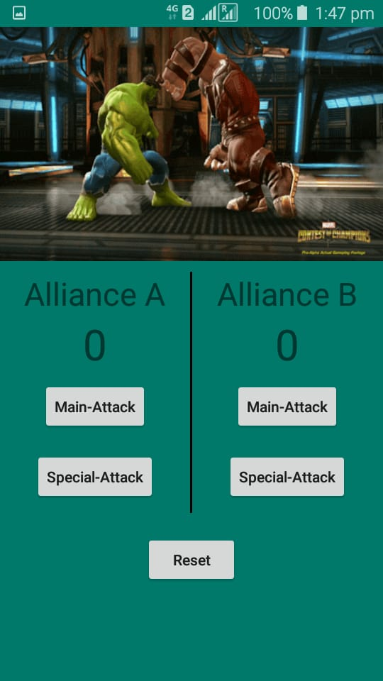

# ScoreKeeperAppNanoDegreeChallenge_Udacity
This app is to track the score gained by both the team who are participating in the game.

**#Image of initial score in Potrait mode**

**#Layout of the app after score button pressed**

**#Layout of the app after score button pressed**

**#Layout of the app after reset the button to change the score to 0**

