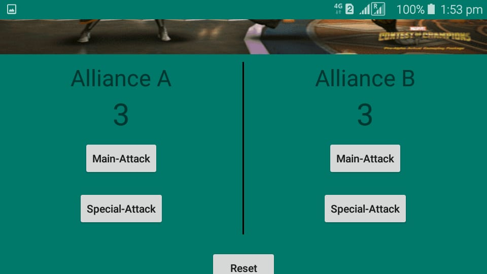

# ScoreKeeperAppNanoDegreeChallenge_Udacity
This app is to track the score gained by both the team who are participating in the game.

## Development Language Used:

- [x] JAVA
- [x] XML

## Image of initial score in Potrait mode

## Layout of the app after score button pressed

## Score is preserved after changing orientation (Potrait to Landscape mode)

## Layout of the app after reset the button to change the score to initial state

## Enjoy Coding 

Contact me for real project 

Tweet me to get connected with Tech World 
